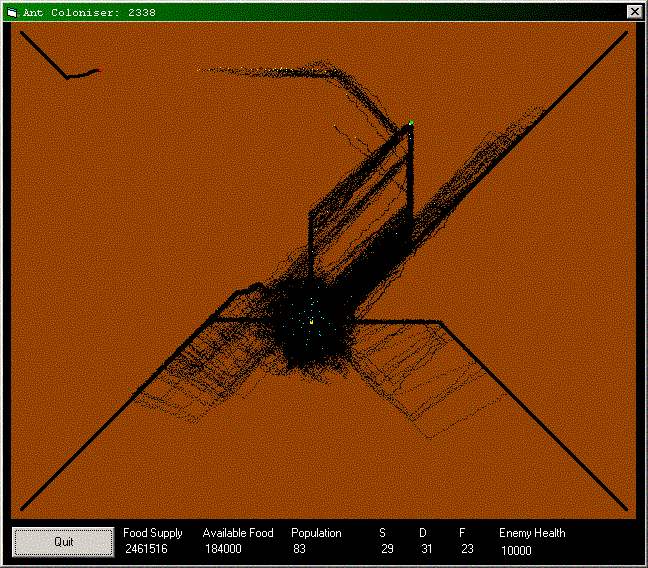



## Ant Simulator

### Description

This code will simulate an Ant Colony. This is a bit of fun and not something to be taken seriously. There are no comments and may be scruffy in places. Perhaps someone out there would like to make a screen saver of it.
 
### More Info
 

             |
---                |---
**Submitted On**   |2003-03-11 15:45:56
**By**             |[David Alan Edwards](https://github.com/Planet-Source-Code/PSCIndex/blob/master/ByAuthor/david-alan-edwards.md)
**Level**          |Intermediate
**User Rating**    |4.9 (34 globes from 7 users)
**Compatibility**  |VB 6\.0
**Category**       |[Graphics](https://github.com/Planet-Source-Code/PSCIndex/blob/master/ByCategory/graphics__1-46.md)
**World**          |[Visual Basic](https://github.com/Planet-Source-Code/PSCIndex/blob/master/ByWorld/visual-basic.md)
**Archive File**   |[Ant\_Simula1558403122003\.zip](https://github.com/Planet-Source-Code/david-alan-edwards-ant-simulator__1-43964/archive/master.zip)

